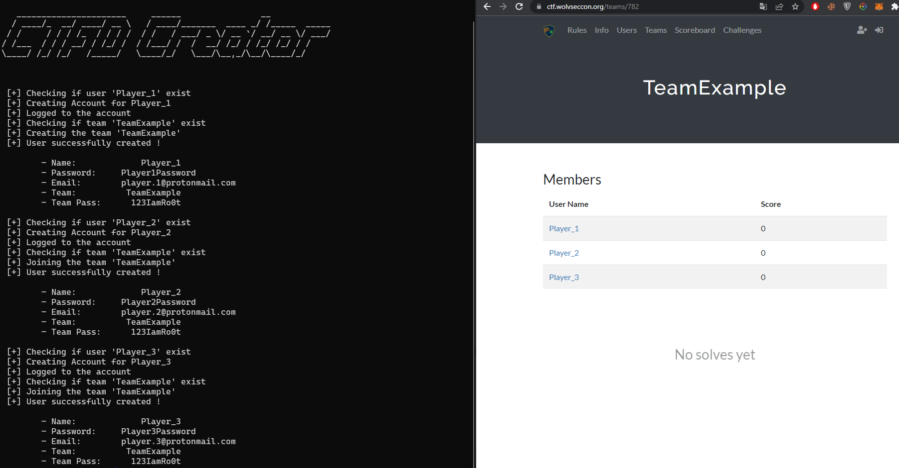

<p align="center">
  
</p>

#  CTFD-Account-Creator

# Description:

This tool is used to automatically create accounts for a complete team on CTFD platform.

## Commands :
```
usage: Ctfd-Account-Creator.py [-h] -u URL -c CONFIG_PATH [-v] [-q] [-d]

This tool is used to automatically create accounts on CTFD platform.

optional arguments:
  -h, --help            show this help message and exit
  -u URL, --url URL     Url of the Ctfd.
  -c CONFIG_PATH, --config CONFIG_PATH
                        Path of the config (*.json).
  -v, --verbose         Use verbose mode.
  -q, --quit            Use quit mode.
  -d, --discord         Displays the account created in a Discord Message template
```

## Usage:

```bash
python3 Ctfd-Account-Creator -u "https://ctf.example.com" -c ./my-team.json -v
```

## Installation :
```bash
git clone https://github.com/Vozec/Ctfd-Account-Creator.git
cd Ctfd-Account-Creator
python3 -m pip install -r requirements.txt
```

## Config :

*Example*: example.json
```bash
{
	"team":"TeamExample",
	"teampwd":"123IamRo0t",
	"users": [
		["PlayerNumber1","playerNumber1@protonmail.com","Player1Password"],
		["PlayerNumber2","playerNumber2@protonmail.com","Player2Password"],
		["PlayerNumber3","playerNumber3@protonmail.com","Player3Password"]
	]
}
```


## Options :
- **--discord** : Displays the created account in discord message format ( \`\`\` ... \`\`\`)
- **--quit** : Don't displays the logo 'Ctfd Creator'

## Démo :


